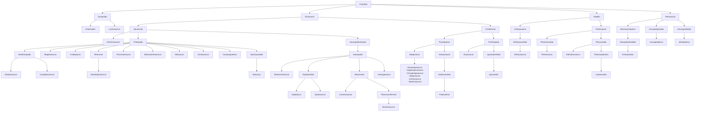

# Cladistics

```mermaid
graph TD;


stegosaurs("`
- Huayangosaurus 
- Gigantspinosaurus
- Chungkingosaurus
- Stegosaurus 
- Kentrosaurus
- Wuerhosaurus
`")

Chordata-->Synapsida
Chordata-->Dinosauria
Chordata-->Reptilia
Chordata-->Pterosauria

Synapsida-->Dimetrodon
Synapsida-->Lystrosaurus

Dinosauria-->Saurischia
Dinosauria-->Ornithischia

Saurischia-->Herrerrasaurus
Saurischia-->Theropoda
Saurischia-->Sauropodomorpha

Ornithischia-->Thyreophora
Ornithischia-->Ornithopoda

Thyreophora-->Stegosauria
Thyreophora-->Ankylosauria

Ornithopoda-->Dryosaurus
Ornithopoda-->Iguanodontidae
Iguanodontidae-->Iguanodon

Stegosauria-->stegosaurs

Ankylosauria-->Nodosauridae
Nodosauridae-->Polacanthus

Theropoda-->Neotheropoda
Theropoda-->Megalosaurus
Theropoda-->Coelophysis
Theropoda-->Tetanurae
Theropoda-->Proceratosaurus
Theropoda-->Metriacanthosaurus
Theropoda-->Allosaurus
Theropoda-->Ceratosaurus
Theropoda-->Compsognathus
Theropoda-->Spinosauridae

Spinosauridae-->Baryonyx

Neotheropoda-->Dilophosaurus
Neotheropoda-->Cryolophosaurus

Sauropodomorpha-->Sauropoda

Sauropoda-->Mamenchisaurus
Sauropoda-->Diplodocidae
Sauropoda-->Macronaria
Sauropoda-->Amargasaurus

Diplodocidae-->Diplodocus
Diplodocidae-->Apatosaurus

Macronaria-->Camarasaurus
Macronaria-->Titanosauriformes

Titanosauriformes-->Brachiosaurus

Tetanurae-->Monolophosaurus

Reptilia-->Ichthyosauria
Reptilia-->Plesiosauria

Ichthyosauria-->Ichthyosauridae 
Ichthyosauridae-->Ichthyosaurus

Plesiosauria-->Plesiosauridae 
Plesiosauria-->Pliosauridae

Plesiosauridae-->Plesiosaurus
Pliosauridae-->Attenborosaurus
Pliosauridae-->Thalassophonea
Thalassophonea-->Liopleurodon

Pterosauria-->Macronychoptera
Pterosauria-->Dsungaripteridae
Pterosauria-->Anurognathidae

Anurognathidae-->Jeholopterus

Dsungaripteridae-->Dsungaripterus

Macronychoptera-->Dimorphodontidae 
Dimorphodontidae-->Dimorphodon
```

