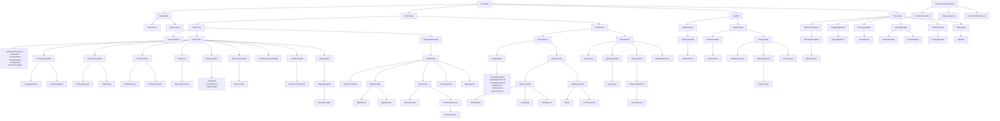

# Cladistics

```mermaid
graph TD;

spinosaurs("`
- Baryonyx
- Suchomimus
- Spinosaurus
`")

stegosaurs("`
- Huayangosaurus 
- Gigantspinosaurus
- Chungkingosaurus
- Stegosaurus 
- Kentrosaurus
- Wuerhosaurus
`")

plainTheropods("`
  - Metriacanthosaurus
  - Allosaurus
  - Ceratosaurus
  - Megalosaurus
  - Coelophysis
  - Moros Intrepidus
`")

Chordata-->Synapsida
Chordata-->Dinosauria
Chordata-->Reptilia
Chordata-->Pterosauria

Synapsida-->Dimetrodon
Synapsida-->Lystrosaurus

Dinosauria-->Saurischia
Dinosauria-->Ornithischia

Saurischia-->Herrerrasaurus
Saurischia-->Theropoda
Saurischia-->Sauropodomorpha

Ornithischia-->Thyreophora
Ornithischia-->Ornithopoda

Thyreophora-->Stegosauria
Thyreophora-->Ankylosauria

Ornithopoda-->Dryosaurus
Ornithopoda-->Iguanodontidae
Ornithopoda-->Styracosterna
Ornithopoda-->Muttaburrasaurus

Styracosterna-->Hadrosauriformes
Hadrosauriformes-->Ouranosaurus

Iguanodontidae-->Iguanodon

Stegosauria-->stegosaurs

Ankylosauria-->Nodosauridae
Ankylosauria-->Ankylosauridae

Ankylosauridae-->Minmi
Ankylosauridae-->Crichtonsaurus

Nodosauridae-->Polacanthus
Nodosauridae-->Sauropelta
Nodosauridae-->Nodosaurus

Theropoda-->plainTheropods
Theropoda-->Compsognathidae
Theropoda-->Proceratosauridae
Theropoda-->Neotheropoda
Theropoda-->Tetanurae
Theropoda-->Spinosauridae
Theropoda-->Dromaeosauridae
Theropoda-->Carcharodontosaurdae
Theropoda-->Ornithomimidae
Theropoda-->Megaraptora

Megaraptora-->Megaraptoridae
Megaraptoridae-->Australovenator

Ornithomimidae-->Archaeornithomimus

Carcharodontosauridae-->Acrocanthosaurus
Carcharodontosauridae-->Giganotosaurus
Carcharodontosauridae-->Carcharodontosaurus

Dromaeosauridae-->Deinonychus

Proceratosauridae-->Proceratosaurus
Proceratosauridae-->Yutyrannus

Compsognathidae-->Compsognathus
Compsognathidae-->Sinosauropteryx

Spinosauridae-->spinosaurs

Neotheropoda-->Dilophosaurus
Neotheropoda-->Cryolophosaurus

Sauropodomorpha-->Sauropoda

Sauropoda-->Mamenchisaurus
Sauropoda-->Diplodocidae
Sauropoda-->Macronaria
Sauropoda-->Amargasaurus
Sauropoda-->Nigersaurus

Diplodocidae-->Diplodocus
Diplodocidae-->Apatosaurus

Macronaria-->Camarasaurus
Macronaria-->Titanosauriformes

Titanosauriformes-->Brachiosaurus

Tetanurae-->Monolophosaurus

Reptilia-->Ichthyosauria
Reptilia-->Plesiosauria

Ichthyosauria-->Ichthyosauridae 
Ichthyosauridae-->Ichthyosaurus

Plesiosauria-->Plesiosauridae 
Plesiosauria-->Pliosauridae

Plesiosauridae-->Plesiosaurus
Pliosauridae-->Attenborosaurus
Pliosauridae-->Thalassophonea
Pliosauridae-->Kronosaurus
Thalassophonea-->Liopleurodon

Pterosauria-->Macronychoptera
Pterosauria-->Dsungaripteridae
Pterosauria-->Anurognathidae
Pterosauria-->Anhangueridae
Pterosauria-->Ornithocheirae
Pterosauria-->Tapejaridae

Anhangueridae-->Maaradactylus
Anhangueridae-->Cearadactylus

Tapejaridae-->Tapejara

Ornithocheirae-->Tropeognathus

Anurognathidae-->Jeholopterus

Dsungaripteridae-->Dsungaripterus

Macronychoptera-->Dimorphodontidae 
Dimorphodontidae-->Dimorphodon
```

