# Cladistics
What follows is a rough taxonomy that holds all the species present in JWE2. 
## Considerations
### Cladistic Intricacies
(May be incomplete)
- Muttaburrasaurus is not a Hadrosaur, though it looks to be one. It may be a species of Iguanodon, Dryosaur, Hypsolophodon, or Rhabdodon. Recent evidence suggests Rhabdodon, but I have simply left it ambiguous. 
- There are problems in general with my classification of the Ornithopods. "Iguanodontia" may be a wastebasket taxon. 
- I have tremendously shortened the taxonomy for Lystrosaurus and Dimorphodon as they are anomalous creatures in JWE2. 
- Herrerrasaurus: What is it? In the game, it appears to be a raptor - either a Dromeosaur or a Megaraptor. But it's significantly older than the Dromeosaurs. Some scientists have even classified it as closely related to the Plateosaurus. I have, again, left it ambiguous.

# Coolest Stuff in Here
- You might assume Liopleurodon is a type of Mosasaur - amazingly, it is more closely related to the long-necked Plesiosaurs than the lizard-like mosasaurs. 
- Ornithomimids are not Ornithopods, but Theropods.

```mermaid
%%{init: {"flowchart": {"htmlLabels": false}} }%%
flowchart LR;

MorosIntrepidus["Moros Intrepidus"]
trex["Tyrannosaurus Rex"]


Chordata-->Synapsida
Chordata-->Dinosauria
Chordata-->Reptilia
Chordata-->Pterosauria

Synapsida-->Dimetrodon
Synapsida-->Lystrosaurus

Dinosauria-->Saurischia
Dinosauria-->Ornithischia

Saurischia-->Herrerrasaurus
Saurischia-->Theropoda
Saurischia-->Sauropodomorpha

Ornithischia-->Thyreophora
Ornithischia-->Ornithopoda
Ornithischia-->Ceratopsia
Ornithischia-->Pachycephalosauridae

Pachycephalosauridae-->Homalocephale
Pachycephalosauridae-->Pachycephalosaurus
Pachycephalosauridae-->Dracorex
Pachycephalosauridae-->Stygimoloch

Ceratopsia-->Ceratopsidae

Ceratopsidae-->Chasmosaurus
Ceratopsidae-->Pentaceratops
Ceratopsidae-->Nasutoceratops
Ceratopsidae-->Styracosaurus
Ceratopsidae-->Sinoceratops
Ceratopsidae-->Pachyrhinosaurus
Ceratopsidae-->Torosaurus
Ceratopsidae-->Triceratops

Thyreophora-->Stegosauria
Thyreophora-->Ankylosauria

Ornithopoda-->Dryosaurus
Ornithopoda-->Iguanodontidae
Ornithopoda-->Styracosterna
Ornithopoda-->Muttaburrasaurus
Ornithopoda-->Hadrosauridae

Hadrosauridae-->Tsintaosaurus
Hadrosauridae-->Corythosaurus
Hadrosauridae-->Parasaurolophus
Hadrosauridae-->Maiasaura
Hadrosauridae-->Edmontosaurus
Hadrosauridae-->Olorotitan

Styracosterna-->Hadrosauriformes

Hadrosauriformes-->Ouranosaurus

Iguanodontidae-->Iguanodon

Stegosauria-->Stegosauridae
Stegosauria-->Huayangosauridae

Huayangosauridae-->Huayangosaurus

Stegosauridae-->Gigantspinosaurus
Stegosauridae-->Chungkingosaurus
Stegosauridae-->Stegosaurus
Stegosauridae-->Kentrosaurus
Stegosauridae-->Wuerhosaurus

Ankylosauria-->Nodosauridae
Ankylosauria-->Ankylosauridae

Ankylosauridae-->Ankylosaurus
Ankylosauridae-->Minmi
Ankylosauridae-->Crichtonsaurus
Ankylosauridae-->Euoplocephalus

Nodosauridae-->Polacanthus
Nodosauridae-->Sauropelta
Nodosauridae-->Nodosaurus

Theropoda-->Megalosauridae-->Megalosaurus
Theropoda-->Coelophysidae-->Coelophysis
Theropoda-->Metriacanthosauridae-->Metriacanthosaurus
Theropoda-->Ceratosauridae-->Ceratosaurus
Theropoda-->Allosauridae-->Allosaurus
Theropoda-->MorosIntrepidus
Theropoda-->Compsognathidae
Theropoda-->Proceratosauridae
Theropoda-->Neotheropoda
Theropoda-->Tetanurae
Theropoda-->Spinosauridae
Theropoda-->Dromaeosauridae
Theropoda-->Carcharodontosauridae
Theropoda-->Ornithomimidae
Theropoda-->Megaraptora
Theropoda-->Troodontidae
Theropoda-->Oviraptoridae
Theropoda-->Deinocheiridae
Theropoda-->Abelisauridae
Theropoda-->Tyrannosauridae
Theropoda-->Therizinosauridae

Tyrannosauridae-->Albertosaurus
Tyrannosauridae-->trex
Tyrannosauridae-->Qianzhousaurus

Therizinosauridae-->Therizinosaurus

Abelisauridae-->Carnotaurus
Abelisauridae-->Majungasaurus

Deinocheiridae-->Deinocheirus

Oviraptoridae-->Oviraptor

Troodontidae-->Troodon

Megaraptora-->Megaraptoridae
Megaraptoridae-->Australovenator

Ornithomimidae-->Archaeornithomimus
Ornithomimidae-->Struthiomimus
Ornithomimidae-->Gallimimus

Carcharodontosauridae-->Acrocanthosaurus
Carcharodontosauridae-->Giganotosaurus
Carcharodontosauridae-->Carcharodontosaurus

Dromaeosauridae-->Deinonychus
Dromaeosauridae-->Velociraptor
Dromaeosauridae-->Pyroraptor
Dromaeosauridae-->Atrociraptor

Proceratosauridae-->Proceratosaurus
Proceratosauridae-->Yutyrannus

Compsognathidae-->Compsognathus
Compsognathidae-->Sinosauropteryx

Spinosauridae-->Spinosaurus
Spinosauridae-->Baryonxyx
Spinosauridae-->Suchomimus

Neotheropoda-->Dilophosaurus
Neotheropoda-->Cryolophosaurus

Sauropodomorpha-->Sauropoda

Sauropoda-->Mamenchisaurus
Sauropoda-->Diplodocidae
Sauropoda-->Macronaria
Sauropoda-->Dicraeosauridae-->Amargasaurus
Sauropoda-->Rebbachisauridae -->Nigersaurus

Diplodocidae-->Diplodocus
Diplodocidae-->Apatosaurus

Macronaria-->Camarasauridae-->Camarasaurus
Macronaria-->Titanosauria

Titanosauria-->Brachiosauridae-->Brachiosaurus
Titanosauria-->Lithostrotia 

Lithostrotia-->Dreadnoughtus
Lithostrotia-->Saltasauridae-->Alamosaurus

Tetanurae-->Monolophosaurus

Reptilia-->Ichthyosauria
Reptilia-->Plesiosauria
Reptilia-->Squamata

Squamata-->Mosasauridae

Mosasauridae-->Tylosaurus
Mosasauridae-->Mosasaurus

Ichthyosauria-->Ichthyosauridae 
Ichthyosauridae-->Ichthyosaurus

Plesiosauria-->Plesiosauridae 
Plesiosauria-->Pliosauridae
Plesiosauria-->Elasmosauridae

Plesiosauridae-->Plesiosaurus

Elasmosauridae-->Styxosaurus
Elasmosauridae-->Elasmosaurus

Pliosauridae-->Attenborosaurus
Pliosauridae-->Liopleurodon
Pliosauridae-->Kronosaurus

Pterosauria-->Macronychoptera
Pterosauria-->Dsungaripteridae
Pterosauria-->Anurognathidae
Pterosauria-->Anhangueridae
Pterosauria-->Ornithocheirae
Pterosauria-->Tapejaridae
Pterosauria-->Pteranodontidae
Pterosauria-->Azhdarchidae
Pterosauria-->Nyctosauridae

Nyctosauridae-->Barbaridactylus

Azhdarchidae-->Quetzalcoatlus

Pteranodontidae-->Pteranodon
Pteranodontidae-->Geosternbergia

Anhangueridae-->Maaradactylus
Anhangueridae-->Cearadactylus

Tapejaridae-->Tapejara

Ornithocheirae-->Tropeognathus

Anurognathidae-->Jeholopterus

Dsungaripteridae-->Dsungaripterus

Macronychoptera-->Dimorphodontidae 
Dimorphodontidae-->Dimorphodon
```

