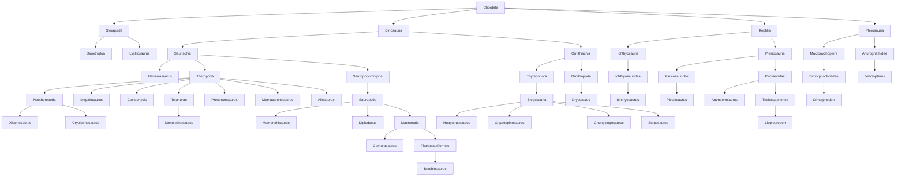

# Cladistics

```mermaid
graph TD;

Chordata-->Synapsida
Chordata-->Dinosauria
Chordata-->Reptilia
Chordata-->Pterosauria

Synapsida-->Dimetrodon
Synapsida-->Lystrosaurus

Dinosauria-->Saurischia
Dinosauria-->Ornithischia

Saurischia-->Herrerrasaurus
Saurischia-->Theropoda
Saurischia-->Sauropodomorpha

Ornithischia-->Thyreophora
Ornithischia-->Ornithopoda

Thyreophora-->Stegosauria
Ornithopoda-->Dryosaurus

Stegosauria-->Huayangosaurus
Stegosauria-->Gigantspinosaurus
Stegosauria-->Chungkingosaurus
Stegosauria-->Stegosaurus

Theropoda-->Neotheropoda
Theropoda-->Megalosaurus
Theropoda-->Coelophysis
Theropoda-->Tetanurae
Theropoda-->Proceratosaurus
Theropoda-->Metriacanthosaurus
Theropoda-->Allosaurus

Neotheropoda-->Dilophosaurus
Neotheropoda-->Cryolophosaurus

Sauropodomorpha-->Sauropoda

Sauropoda-->Mamenchisaurus
Sauropoda-->Diplodocus
Sauropoda-->Macronaria

Macronaria-->Camarasaurus
Macronaria-->Titanosauriformes

Titanosauriformes-->Brachiosaurus

Tetanurae-->Monolophosaurus

Reptilia-->Ichthyosauria
Reptilia-->Plesiosauria

Ichthyosauria-->Ichthyosauridae 
Ichthyosauridae-->Ichthyosaurus

Plesiosauria-->Plesiosauridae 
Plesiosauria-->Pliosauridae

Plesiosauridae-->Plesiosaurus
Pliosauridae-->Attenborosaurus
Pliosauridae-->Thalassophonea
Thalassophonea-->Liopleurodon

Pterosauria-->Macronychoptera
Pterosauria-->Anurognathidae
Anurognathidae-->Jeholopterus

Macronychoptera-->Dimorphodontidae 
Dimorphodontidae-->Dimorphodon
```

