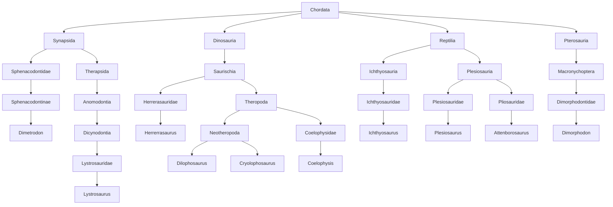

# Cladistics

```mermaid
graph TD;

Chordata-->Synapsida
Chordata-->Dinosauria
Chordata-->Reptilia
Chordata-->Pterosauria

Synapsida-->Sphenacodontidae
Synapsida-->Therapsida

Sphenacodontidae-->Sphenacodontinae
Sphenacodontinae-->Dimetrodon

Therapsida-->Anomodontia
Anomodontia-->Dicynodontia
Dicynodontia-->Lystrosauridae
Lystrosauridae-->Lystrosaurus

Dinosauria-->Saurischia

Saurischia-->Herrerasauridae
Saurischia-->Theropoda

Theropoda-->Neotheropoda

Neotheropoda-->Dilophosaurus
Neotheropoda-->Cryolophosaurus

Herrerasauridae-->Herrerrasaurus

Theropoda-->Coelophysidae
Coelophysidae-->Coelophysis

Reptilia-->Ichthyosauria
Reptilia-->Plesiosauria

Ichthyosauria-->Ichthyosauridae 
Ichthyosauridae-->Ichthyosaurus

Plesiosauria-->Plesiosauridae 
Plesiosauria-->Pliosauridae

Plesiosauridae-->Plesiosaurus
Pliosauridae-->Attenborosaurus

Pterosauria-->Macronychoptera
Macronychoptera-->Dimorphodontidae 
Dimorphodontidae-->Dimorphodon
```

