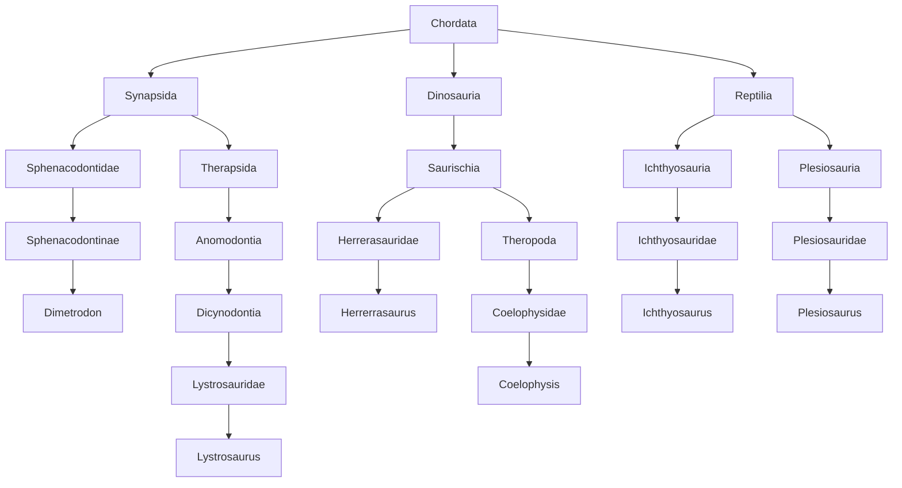

# Cladistics

```mermaid
graph TD;

Chordata-->Synapsida
Chordata-->Dinosauria
Chordata-->Reptilia

Synapsida-->Sphenacodontidae
Synapsida-->Therapsida

Sphenacodontidae-->Sphenacodontinae
Sphenacodontinae-->Dimetrodon

Therapsida-->Anomodontia
Anomodontia-->Dicynodontia
Dicynodontia-->Lystrosauridae
Lystrosauridae-->Lystrosaurus

Dinosauria-->Saurischia

Saurischia-->Herrerasauridae
Saurischia-->Theropoda

Herrerasauridae-->Herrerrasaurus

Theropoda-->Coelophysidae
Coelophysidae-->Coelophysis

Reptilia-->Ichthyosauria
Reptilia-->Plesiosauria

Ichthyosauria-->Ichthyosauridae 
Ichthyosauridae-->Ichthyosaurus

Plesiosauria-->Plesiosauridae 
Plesiosauridae-->Plesiosaurus
```

