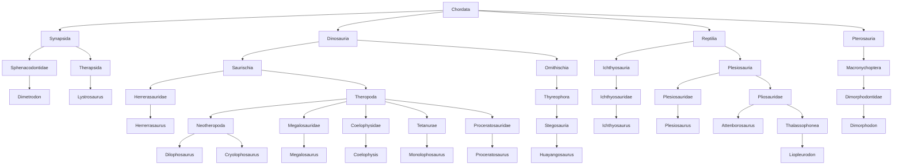

# Cladistics

```mermaid
graph TD;

Chordata-->Synapsida
Chordata-->Dinosauria
Chordata-->Reptilia
Chordata-->Pterosauria

Synapsida-->Sphenacodontidae
Synapsida-->Therapsida

Sphenacodontidae-->Dimetrodon

Therapsida-->Lystrosaurus

Dinosauria-->Saurischia
Dinosauria-->Ornithischia

Saurischia-->Herrerasauridae
Saurischia-->Theropoda

Ornithischia-->Thyreophora
Thyreophora-->Stegosauria
Stegosauria-->Huayangosaurus

Theropoda-->Neotheropoda
Theropoda-->Megalosauridae
Theropoda-->Coelophysidae
Theropoda-->Tetanurae
Theropoda-->Proceratosauridae

Neotheropoda-->Dilophosaurus
Neotheropoda-->Cryolophosaurus

Tetanurae-->Monolophosaurus
Herrerasauridae-->Herrerrasaurus
Megalosauridae-->Megalosaurus
Coelophysidae-->Coelophysis

Proceratosauridae-->Proceratosaurus

Reptilia-->Ichthyosauria
Reptilia-->Plesiosauria

Ichthyosauria-->Ichthyosauridae 
Ichthyosauridae-->Ichthyosaurus

Plesiosauria-->Plesiosauridae 
Plesiosauria-->Pliosauridae

Plesiosauridae-->Plesiosaurus
Pliosauridae-->Attenborosaurus
Pliosauridae-->Thalassophonea
Thalassophonea-->Liopleurodon

Pterosauria-->Macronychoptera
Macronychoptera-->Dimorphodontidae 
Dimorphodontidae-->Dimorphodon
```

