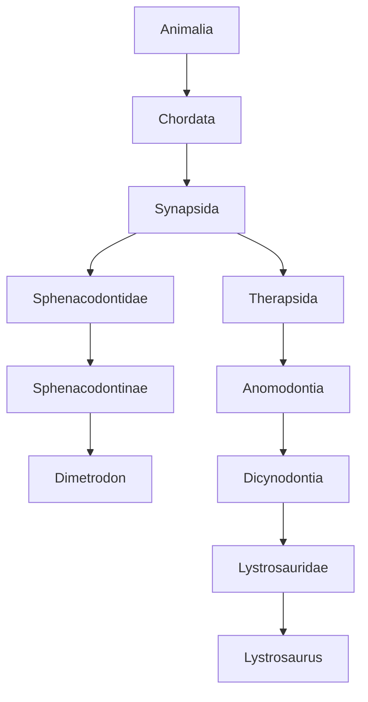

# Cladistics

```mermaid
graph TD;

Animalia-->Chordata
Chordata-->Synapsida
Synapsida-->Sphenacodontidae
Sphenacodontidae-->Sphenacodontinae
Sphenacodontinae-->Dimetrodon

Synapsida-->Therapsida
Therapsida-->Anomodontia
Anomodontia-->Dicynodontia
Dicynodontia-->Lystrosauridae
Lystrosauridae-->Lystrosaurus
```

